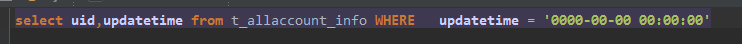
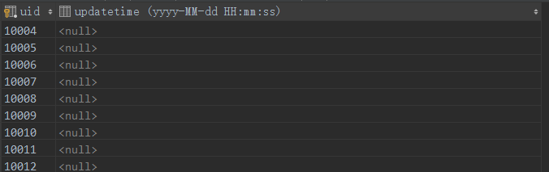

## 2-15 ##
###Pro1:  
####Value '0000-00-00 00:00:00' can not be represented as java.sql.Timestamp  
在库中直接查询发现确实存在'0000-00-00 00:00:00',而是奇怪的是显示的全部为null...好吧,可能是库的显示问题

> **用mysql url参数:  
> exception (the default), which throws an SQLException with an SQLState of S1009.
convertToNull, which returns NULL instead of the date.  
round, which rounds the date to the nearest closest value which is 0001-01-01.**

个人觉得这种问题在数据库设计时是可以避免的 , 设计库时需要注意到一些细节问题 , 对编码人员可以更友好一些.
  