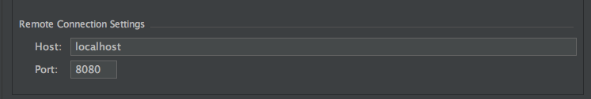
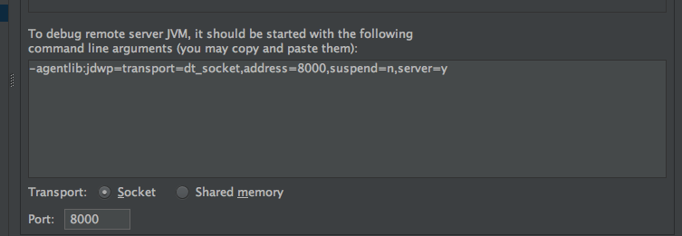

##IDEA远程调试Tomcat
之前基本上都是打log来找BUG的，看看log基本上也就知道什么问题了。但是把有些问题还是调试来的方便，于是开始研究怎么远程调试Tomcat。。。。表示各种教程太杂太乱，基本上不懂原理。弄了半天，终于能够调试了。。记录下。
###一、tomcat的jpda服务
> **什么是JPDA呢**  
>JPDA(Java Platform Debugger Architecture) 是 Java 平台调试体系结构的缩写，通过 JPDA 提供的 API，开发人员可以方便灵活的搭建 Java 调试应用程序。JPDA 主要由三个部分组成：Java 虚拟机工具接口（JVMTI），Java 调试线协议（JDWP），以及 Java 调试接口（JDI）。而像Eclipse和IDEA这种开发工具提供的图形界面的调试工具，其实就是实现了JDI。关于JPDA的详细信息，可以查看developerWorks上的系列文章----[深入Java调试体系](http://www.ibm.com/developerworks/cn/views/java/libraryview.jsp?search_by=深入+Java+调试体系)  
>- - - - - - - - - - - - -来自[http://blog.csdn.net/mhmyqn/article/details/49209541]()

tomcat中启动jpda服务

    ./catalina.sh jpda start
在catalina.sh脚本中，可看到jpda的默认配置是这样的  

    if [ "$1" = "jpda" ] ; then
      if [ -z "$JPDA_TRANSPORT" ]; then
        JPDA_TRANSPORT="dt_socket"
      fi
      if [ -z "$JPDA_ADDRESS" ]; then
        JPDA_ADDRESS="8000"
      fi
      if [ -z "$JPDA_SUSPEND" ]; then
        JPDA_SUSPEND="n"
      fi
      if [ -z "$JPDA_OPTS" ]; then
        JPDA_OPTS="-agentlib:jdwp=transport=$JPDA_TRANSPORT,address=$JPDA_ADDRESS,server=y,suspend=$JPDA_SUSPEND"
      fi
      CATALINA_OPTS="$JPDA_OPTS $CATALINA_OPTS"
      shift
    fi
默认的端口是8000，当然也可以改成自己喜欢的端口。好吧，其实这些脚本我根本看不懂，但是对shell script一直有着神圣的敬意，于是我觉这个周末学学这个神奇的东西。。跑题了
###二、IDEA如何操作
**1、添加remote tomcat server**  
**2、填写主机信息，IP:PORT(注意这里的port不是jpda调试的端口，而是tomcat访问端口）**

**3、进入startup/connection--->Debug　　看到下面图的信息,把下面的端口改为jpda调试端口8000**

####OK,通过 ./catalina.sh jpda start命令重新启动tomcat后就可以在idea中调试了。。（注意代码版本要和tomcat中部署的一致。。tomcat关闭命令 catalina.sh stop）

    本人使用的IDEA版本 15.2
    tomcat版本apache-tomcat-8.0.32
    系统：osx 10.11.2(系统不同会稍微不同。。请自行探讨) 
    
 ************分割线*****2016-3-15**********  
###问题记录
在使用过程过还是遇到了一些问题，主要还是端口的问题。当一台机器上得一个端口已经与远程tomcat宿主机开始建立通讯的时候（tcp ESTABLISHED）的时候，会无法再次建立连接。
但问题是可能已经建立的连接你也不知道是如何出现了，这个时候需要查看远程主机的端口使用情况，查看是否已经建立连接。想办法把这个连接关闭（重启IDE或者杀进程等等），再去建立自己的想要的连接来调试。 