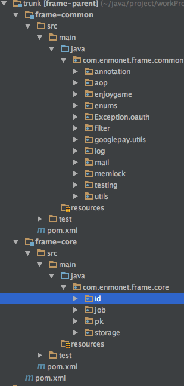
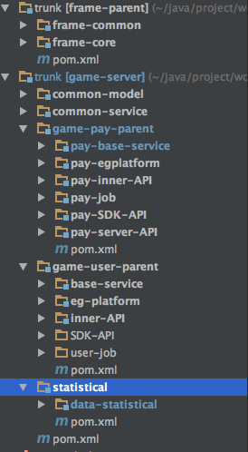

##enjoy_game服务端
- - -
4.29，五一假期的第一天。刚刚看完InfoQ里面一个架构漫谈系列文章,下面是链接
> [架构漫谈（一）](http://www.infoq.com/cn/articles/an-informal-discussion-on-architecture-part01?utm_campaign=rightbar_v2&utm_source=infoq&utm_medium=articles_link&utm_content=link_text)  
 
说实话，个人眼界和实力不够，对其中谈到得东西觉得，诶，好像是这么个理，好像很厉害的样子。。
读完后，确实能感受到不一样层次的人，想得东西确实不一样。

刚看完这个架构的文章，趁热打铁，加上之前一直想梳理下自己目前项目的结构，所以就有了这篇。。
- - -
###一.方大师和蒋小师留下的组件
  
基本就是上面的frame项目了。顺便梳理下frame.一个个来
> **Common:**  
> 
> * annotation ，aop ，memlock 使用AOP做的一些辅助工作，包括日志收集，分布式加锁.
> * enum 必要的一些枚举信息
> * exception 项目异常处理
> * filter 里面包括签名验证，http请求的基本信息的日志收集
> * mail 邮件
> * testing 测试用的一些工具
> * utils 工具类包。  
> 
> **core:**  
> 
> * id,id生成器
> * job 异步作业
> * pk 主键定义
> * storage 存储相关。包括缓存和硬盘存储，

###二.大牛们考虑的东西
一中对frame进行了简单列举。那么从这些东西中能知道大牛在考虑什么。
####1.作为web service接口，为外返回的信息一致性。
这里主要包括系统的异常控制和一个将返回信息处理成统一格式JSON串的工具类。
> {"code":"XXX","reason":"reason"}  
> {"code":"XXX","result":{ }}

####2.存储相关（内存存储和硬盘存储）
> * 仓库接口（所有仓库必须遵守的契约，常用增删改查）
> * 为仓库准备的主键类，其中包括为memcached生产统一格式key，mysql操作常用的的主键
> * json encode和decode，memcached的in,out. 

####3.id生成器
为分布式准备的ID生成器，以及在测试时使用的模拟ID生成器。
####3.测试工具类
 完全为测试用例准备，包括内存数据库h2，mock封装工具，一些常用的测试工具类
 
###三.目前项目结构的划分

> common-model model类  
> common-service 公共服务  
> game-pay-parent  支付模块  
> >pay-base 该模块下基础模块  
> >pay-egplatform 为内部后台系统提供的接口服务  
> >pay-inner 为PHP前端提供内部接口服务
> >pay-job 支付的一些异步作业任务。  
> >pay-sdk 为手机端提供的接口服务  
> >pay-server 为第三方支付提供回调服务
>
> game-user-parent 用户模块  
> >base-service 用户模块下基础服务  
> >eg-platform 为内部后台系统提供的user模块接口  
> >inner-API 为PHP提供的内部接口服务  
> >sdk-api 为手机端提供的接口服务
>
> statistical 数据统计模块  

十分小的一个系统，整个大的划分就系统和支付系统划分。  

**划分原则 - - - 降低耦合，提高内聚。模块间不相互影响**  
 
第一步的划分，用户和支付（后面需求不断增加后，用户系统的下许多服务被转到common-service下）；  
第二步的划分，依据模块功能，各司其职。  
以支付系统为例，除了基础模块，还包括5个接口提供，分别功能：  

 * 公司内部后台系统服务（比如用户联系客服，需要后台帮忙找回账号或者更改密码等服务）
 * 用户通过PHP H5页面支付服务。
 * 用户在游戏（app应用内）支付服务
 * 为第三方支付提供的回调接口
 * 支付任务  
 
各个模块完全独立，其中一个改动甚至挂掉不会影响其他服务。最近要作web端的游戏商城，目前需求的功能比较少，只需要为PHP提供几个接口，这个时候，其实可以把这些接口放在pay-inner模块下，当时又发现这个web不应该影响到原来的pay-inner，所以还是准备再起一个新模块。尽管目前此模块功能少，但是独立的东西，尽量不要放一起，而且需要考虑以后的需求增加。
 
###四.展望未来
目前就业务量来看，单机部署基本无压力。数据库性能不错上已经做了读写分离，压力不大。
可以改善的点：
> * memcached实现多节点分布式，目前是单memcached，挂了基本整个系统就挂了。。
> * 目前缓存系统并没有发挥，最大用处，后面需要根据一段时间的观察，尽量为可能的mysql读操作加上缓存层。
> * 多机部署，通过nginx来负载均衡。单点的down基本不会影响服务，同时减轻单点压力。

